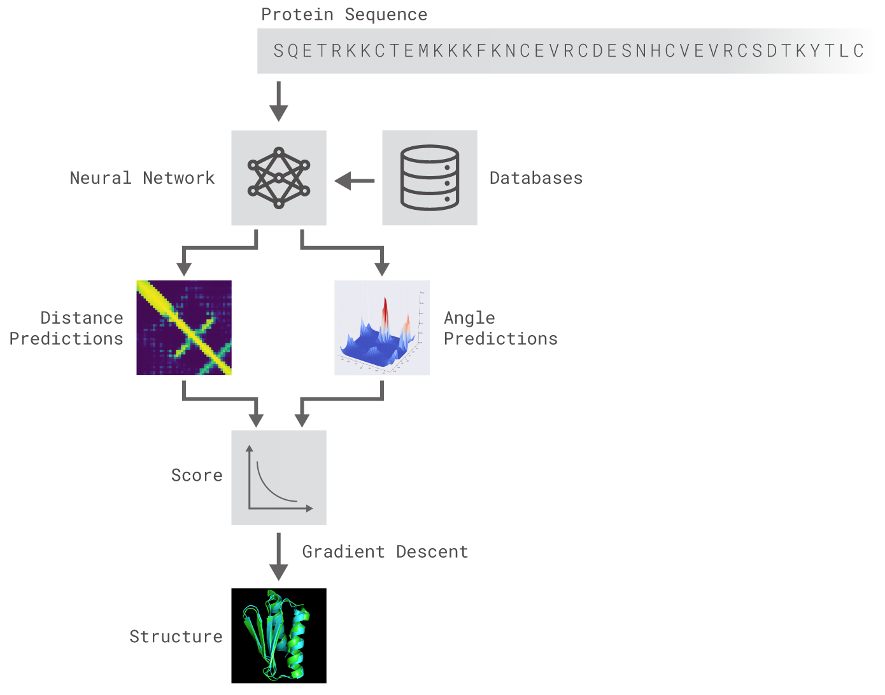

# Repository for Google's AI program by DeepMind

The forked repository is of DeepMind's new Artificial Intelligence based program that allows protein structure prediction. 
The hypothesis of the program is that Protein structure prediction not just based on amino acid sequence but also between the
spatial folding of the amino acids in environment and the program using AI strategies to tackle this issue.

# Strategy of prediction

The strategy of prediction of protein structures from sequences starts with replacing the known intermediate sequences with known homology fragment models. DeepMind has developed a neural network that allows the generation of a dataset that has distance and angle predictions (more about the code further). The dataset once obtained is later posed through a gradient descent method to find the best possible structure based on the predictive dataset.

Format: 

# Instructions for use : 

1. Obtain the data from a reliable source in the required format (preferred format stated is : CASP7 text)
2. Calculate the distances and angles and generate a required dataset.
    Angles : `get_angles_from_coords_py.ipynb`
    Distances : `predicting_distances.ipynb`
3. Train with the dataset
    

# Things that I found interesting :

1. A few of the files were in .jl extension. I checked that, and found that it was Julia programming language. This was     something I was unaware of. I also found that it is dynamic, faster than Python sometimes and follows a similar syntax. Also, it has been proven useful for mathematical functionality problems. Can be a fun thing to try something in Julia!
2. Additionally, Julia combines the uses of C language too. The .jl extension files have various instances of creating vectors and pushing elements into it which sounds cool. It is almost as if we are dealing with the complexity of C lang with the expressiveness of Python.
3. The ipynb files are coded pretty well. I can see that almost everywhere, the PEP8 guidelines are thoroughly obeyed, thus making it a wonderfully expressive and clear script.
4. Creating a training procedure by a not-so-comprehensive dataset that works well.
